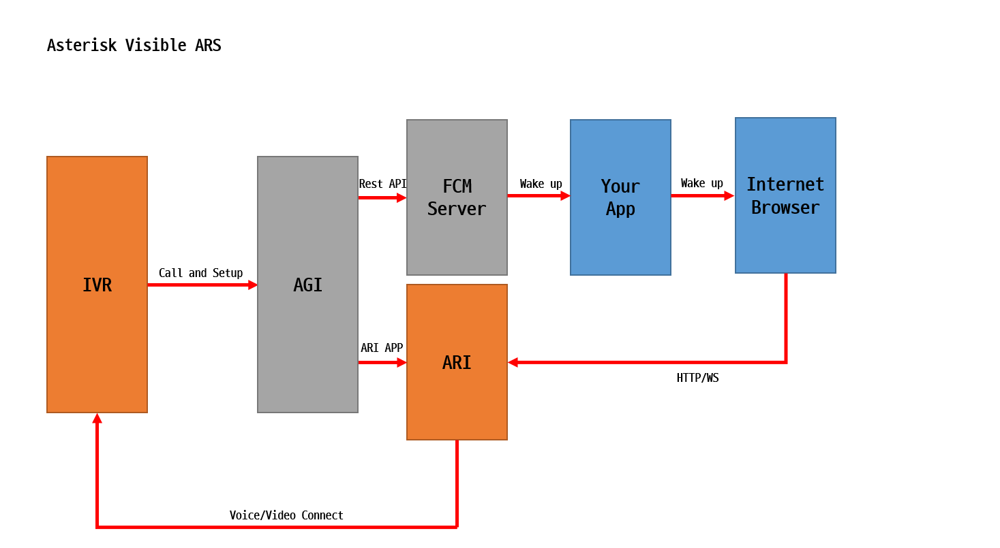

# 
 Asterisk Visible ARS 

What is Asterisk Visible ARS?

It is a system that automatically connects web pages that can guide the voice at the same time as the voice when the call comes in from the Asterisk.

## Flow Chart

> This image is an expected flow chart.  

1. The asterisk IVR calls the AGI when the call first comes in.
2. AGI creates a web page client (React, HTML, JavaScript, etc.) and distributes the address to the FCM server, and runs one app in ARI. (ARI handles clients by implementing a web page server.)
3. The FCM client app installed through the FCM server will wake up, and the FCM client app will wake up the Internet Browser.
4. Access the web page with an Internet browser. The click event occurs through ARI when you connect.

## Contact

[Junho Kim](libtv@naver.com)  
[JongSun Park](ahrl1994@gmail.com)

## HomePage

Github © [Page](https://github.com/A-big-fish-in-a-small-pond/)

## License

this is licensed under [MIT LICENSE](https://github.com/A-big-fish-in-a-small-pond/asterisk-visible-ars).
